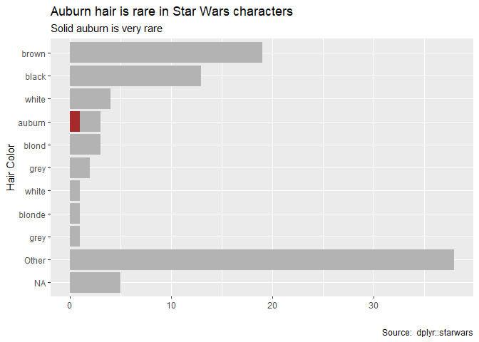

# README

**Short URL**:  https://is.gd/gitshow

Demonstrate a git repo with GitHub using [Alice Bartlett's](https://alicebartlett.co.uk/) [Git for Humans slide deck](https://speakerdeck.com/alicebartlett/git-for-humans) 

## Practice

[GitHub Hello World](https://guides.github.com/activities/hello-world/)

## Example Author Name

Anton Chigurh

## Purpose
This is a demo git repository. Let's push this project/folder/repository to GitHub remote via RStudio. (Hello World.)

## HTTP Ideas

Let's see how far this goes. 

testing part2 of git workshop

## Books

- pride and prejudice
- olive kitteridge
- the power

## Changes for John Poulsen's lab

I thought John's lab would like this document

## Images

## Configuration notes for RStudio/R

https://rfun.library.duke.edu/git/