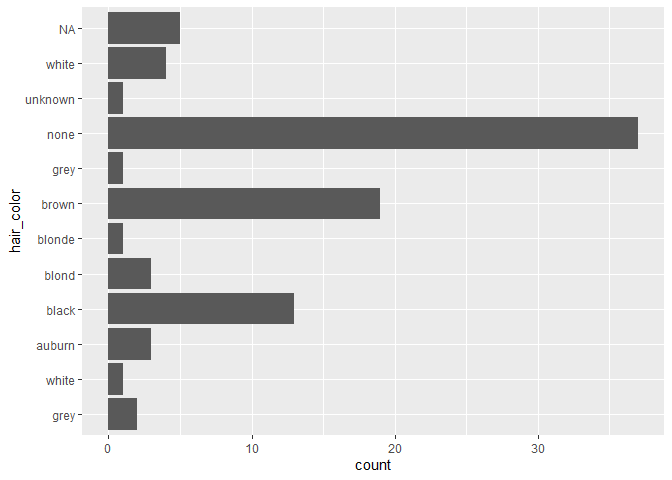
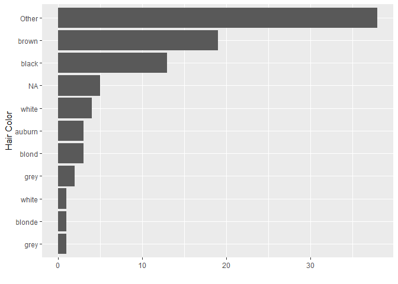
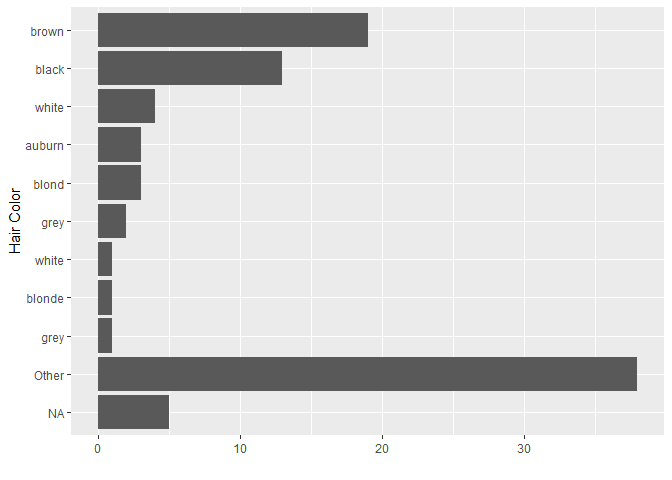
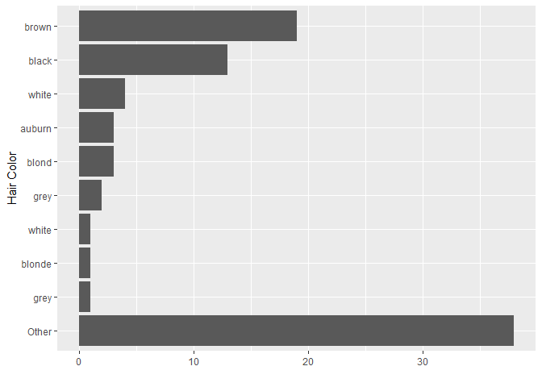
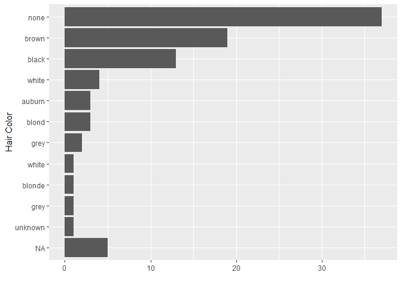
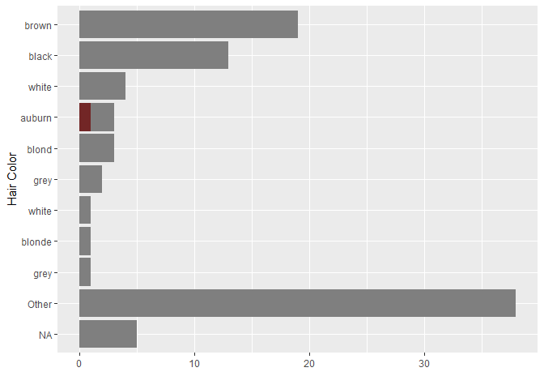

R Notebook
================

``` r
library(tidyverse)
```

``` r
starwars %>%
  separate_rows(hair_color, sep = ",") %>%
  ggplot() +
  geom_bar(aes(hair_color)) +
  coord_flip()
```

<!-- -->

``` r
starwars %>%
  separate_rows(hair_color, sep = ",") %>%
  ggplot() +
  geom_bar(aes(fct_rev(fct_infreq(
    fct_explicit_na(fct_other(hair_color, drop = c("none", "unknown")), na_level = "NA")
  )))) +
  coord_flip() +
  labs(y = "", x = "Hair Color")
```

<!-- -->

``` r
# geom_bar(aes(fct_rev(fct_infreq(hair_color)))) +
# fct_explicit_na(hair_color, na_level = "NA")

starwars %>%
  separate_rows(hair_color, sep = ",") %>%
  ggplot() +
  geom_bar(aes(fct_rev(
    fct_explicit_na(fct_other(
      fct_infreq(hair_color), drop = c("none", "unknown")
    ), na_level = "NA")
  ))) +
  coord_flip() +
  labs(y = "", x = "Hair Color")
```

<!-- -->

``` r
starwars %>%
  separate_rows(hair_color, sep = ",") %>%
  drop_na(hair_color) %>% 
  ggplot() +
  geom_bar(aes(fct_rev(
    fct_explicit_na(fct_other(
      fct_infreq(hair_color), drop = c("none", "unknown")
    ), na_level = "NA")
  ))) +
  coord_flip() +
  labs(y = "", x = "Hair Color")
```

<!-- -->

``` r
starwars %>%
  separate_rows(hair_color, sep = ",") %>%
  ggplot() +
  geom_bar(aes(fct_rev(
    fct_explicit_na(
      fct_infreq(hair_color)
    , na_level = "NA")
  ))) +
  coord_flip() +
  labs(y = "", x = "Hair Color")
```

<!-- -->

``` r
auburn <- starwars %>% 
  filter(hair_color == "auburn")
```

``` r
starwars %>%
  separate_rows(hair_color, sep = ",") %>%
  ggplot() +
  geom_bar(aes(fct_rev(
    fct_explicit_na(fct_other(
      fct_infreq(hair_color), drop = c("none", "unknown")
    ), na_level = "NA")
  )), fill = "grey50") +
  geom_bar(data = auburn, aes(hair_color), fill = "#722626") +
  coord_flip() +
  labs(y = "", x = "Hair Color") 
```

<!-- -->

``` r
  #geom_bar(data = auburn, aes(hair_color), color = "red") +
```

``` r
starwars %>%
  separate_rows(hair_color, sep = ",") %>%
  ggplot() +
  geom_bar(aes(fct_rev(
    fct_explicit_na(fct_other(
      fct_infreq(hair_color), drop = c("none", "unknown")
    ), na_level = "NA")
  )), fill = "grey70") +
  geom_bar(data = starwars %>% filter(hair_color == "auburn"), aes(hair_color), fill = "brown") +
  coord_flip() +
  labs(y = "", x = "Hair Color",
       title = "Auburn hair is rare in Star Wars characters",
       subtitle = "Solid auburn is very rare",
       caption = "Source:  dplyr::starwars") 
```

<!-- -->
